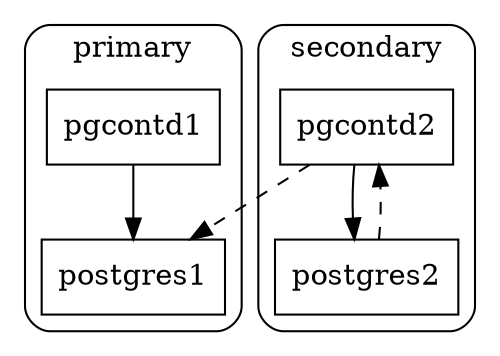

# High availability

https://www.postgresql.org/docs/current/high-availability.html

| Parameter | | |
|-----------|-|-|
| `full_page_writes` | CF | `on`, required for [pg_rewind][]
| `wal_log_hints` | S | `off`, must be `on` for [pg_rewind][]

[pg_rewind]: https://www.postgresql.org/docs/current/app-pgrewind.html

- Consider replication lag/delay when electing new primary.
- ~~Reconfigure replicas after failover.~~

By observing (proxying) [replication messages][], **pgcontd** knows what WAL has
been transmitted to replicas. Specifically, it knows which instances are
satisfying [synchronous replication][].

[replication messages]: https://www.postgresql.org/docs/current/protocol-replication.html
[synchronous replication]: https://www.postgresql.org/docs/current/warm-standby.html#SYNCHRONOUS-REPLICATION

- **pgcontd** on a secondary routes to the current primary.
- `primary_conninfo` on secondary is the same in any topology.
- `primary_conninfo` authentication can be entirely local,
  **pgcontd** can authenticate to **postgres** on the primary.
