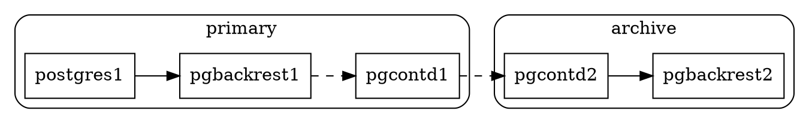
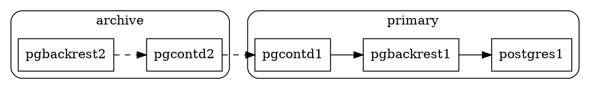
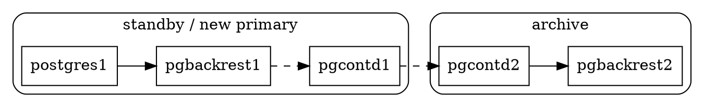

# pgBackRest

https://pgbackrest.org

| Command | PostgreSQL | Repository |
|---------|------------|------------|
| `archive-get`    |yes| -
| `archive-push`   |yes| -
| `backup`         | - |yes
| `check`          |yes|yes
| `expire`         | - |yes
| `info`           |yes|yes
| `restore`        |yes| -
| `stanza-create`  | - |yes
| `stanza-upgrade` | - |yes

```
/etc/pgbackrest/pgbackrest.conf
/etc/pgbackrest/conf.d/*.conf
```

- Ensure archiving is enabled.
- Ensure stanza and paths agree.
- Ensure connectivity to/from remote repository.

```ini
# postgresql.conf (primary, standby)
archive_command = 'pgbackrest --stanza=data archive-push %p'
archive_mode = on
```

```ini
# pgbackrest.conf
[data]
pg1-path = {{.DataDirectory}}

[global]
repo1-path = /var/lib/pgbackrest
repo1-retention-full = {{.Retention}}
```


## Remote Repository

```ini
# pgbackrest.conf (archive)
[data]
pg1-host = pgcontd.localhost
```
```ini
# pgbackrest.conf (primary / standby)
[global]
repo1-host = pgcontd.localhost
```

### Archive (Archive Push)


### Backup


### Restore (Archive Get)


### Backup from Standby

https://pgbackrest.org/user-guide.html#standby-backup

```ini
# pgbackrest.conf (archive)
[data]
pg1-host = pgcontd.localhost
pg2-host = pgcontd.localhost
pg2-host-user = standby
pg2-path = {{.DataDirectory}}

[global]
backup-standby = y
```


Console Logging
```ini
# pgbackrest.conf
[global]
log-level-console = info
log-level-file = off
log-level-stderr = off
log-timestamp = n
```
